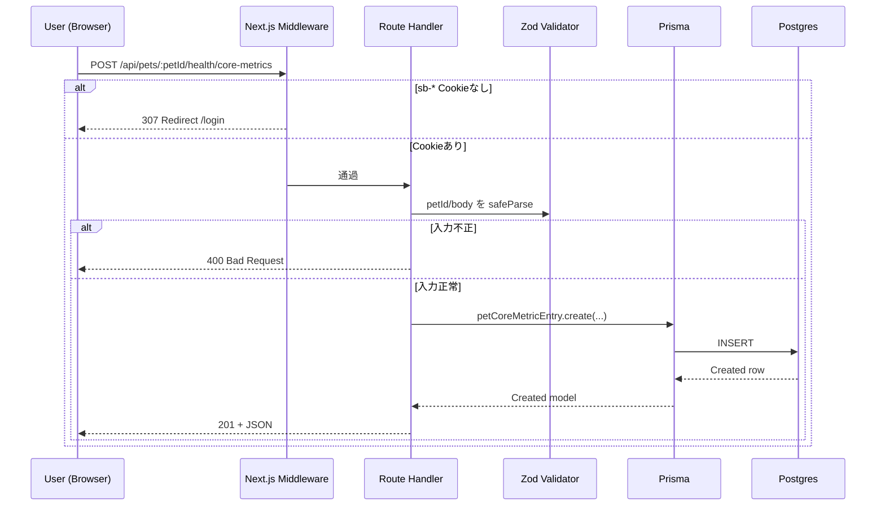
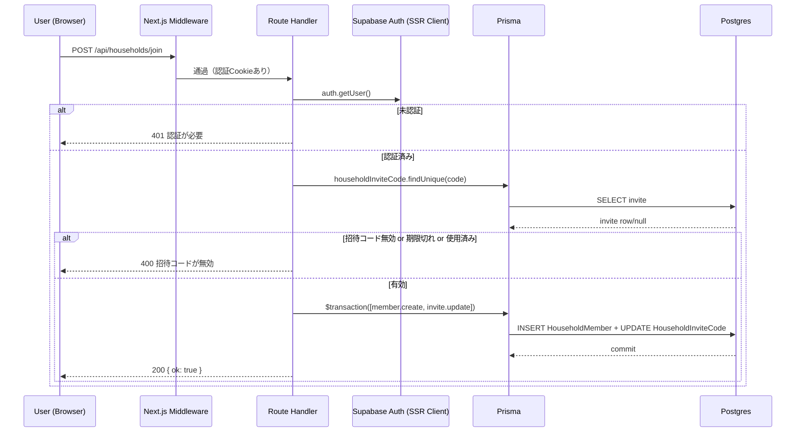
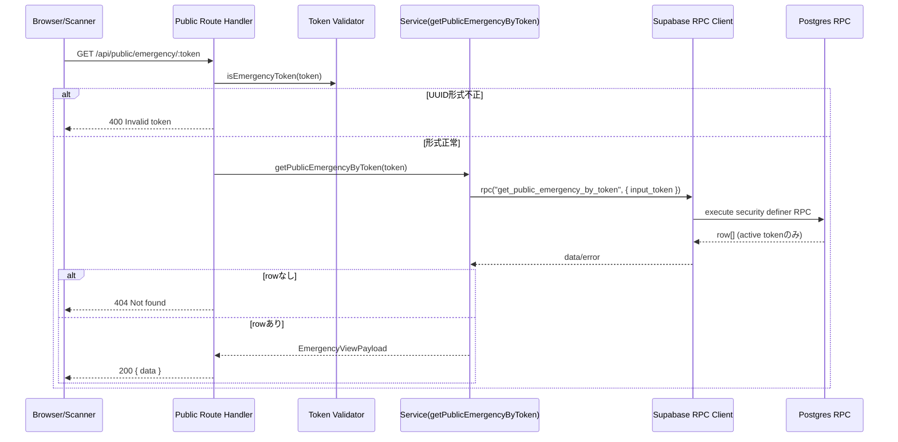

# APIフロー図（シーケンス）

実装中の Route Handler / Service / Supabase(RPC) / Prisma の呼び出し関係を、主要ユースケースごとに整理します。

## 1. コア健康記録の登録（保護API）

対象: `POST /api/pets/:petId/health/core-metrics`

## 2. 招待コード参加

対象: `POST /api/households/join`

## 3. 公開緊急情報の取得（匿名）

対象: `GET /api/public/emergency/:token`

## 補足
- 認証ガードは `middleware.ts` で実施（`/login`, `/e/*`, `/api/public/*` は公開）。
- 非公開APIのドメイン操作は主に Prisma 経由で実装。
- 公開緊急情報は Supabase RPC `get_public_emergency_by_token` を経由し、返却項目を最小化。
