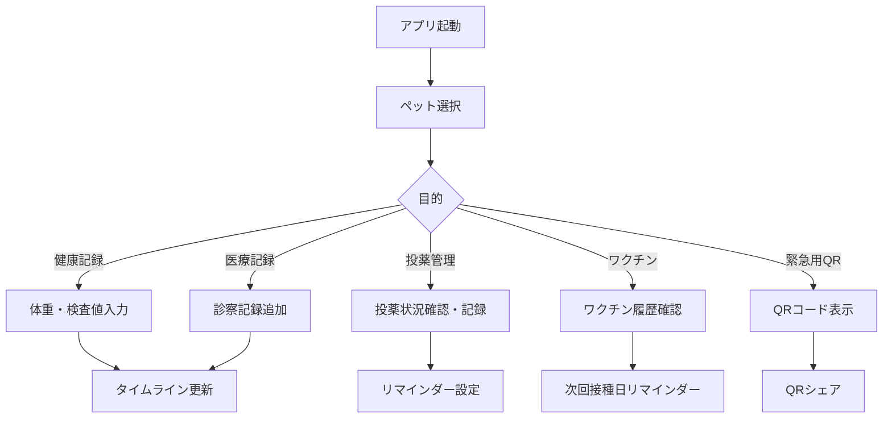
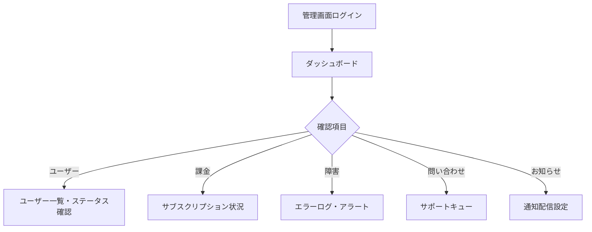

# 01. プロジェクト概要・ビジョン・ミッション

作成日: 2026-07-12 | バージョン: 1.0.0

---

## 目次
1. [プロダクト概要](#1-プロダクト概要)
2. [ビジョン・ミッション](#2-ビジョンミッション)
3. [提供価値](#3-提供価値)
4. [対象ユーザー](#4-対象ユーザー)
5. [利用シーン](#5-利用シーン)
6. [業務フロー](#6-業務フロー)
7. [ユーザーフロー](#7-ユーザーフロー)
8. [画面一覧](#8-画面一覧)
9. [機能一覧](#9-機能一覧)
10. [システム構成](#10-システム構成)

---

## 1. プロダクト概要

### 目的
「動物の救急手帳」は、ペットの緊急医療情報を一元管理し、救急時に瞬時に必要情報を医療従事者へ提供できる **命を守る情報基盤** である。

単なるペット管理アプリではなく、緊急・救急という極限状態でのUXを最優先に設計されたSaaSプラットフォームである。

### 現状の問題
1. **情報分散**: ワクチン証明書、薬の袋、診察カードが別々の場所に散在
2. **緊急時の情報提示困難**: パニック状態で「かかりつけ病院の電話番号」も出てこない
3. **引き継ぎ不可**: ペットホテル・トリマーへの情報共有が毎回手動
4. **夜間救急での課題**: かかりつけ医以外の病院に正確な既往歴を伝えられない
5. **家族間の情報ギャップ**: 配偶者・子供がペットの医療情報を把握していない

### 解決策
QRコード一枚で、救急獣医師がスマートフォンで即座に確認できる構造化された医療情報カードを提供する。

---

## 2. ビジョン・ミッション

### ビジョン
> **「どんな緊急事態でも、あなたのペットの命を守る情報が、確実に届く世界を作る」**

### ミッション
> **「飼い主と医療従事者の間の情報断絶をなくす」**

### 設計哲学
- **Calm Technology**: 緊急時でも迷わない設計
- **Progressive Disclosure**: 通常時は使いやすく、緊急時は瞬時に必要情報へ
- **Zero Config Public Access**: QRコードスキャンだけで医療従事者が情報取得

### バリュープロポジション
```
通常時: 「ペットの健康記録を家族で共有できる安心感」
緊急時: 「病院でパニックにならず、確実に情報を伝えられる」
社会的: 「年間〇万頭の救える命を、情報不足で失わない社会へ」
```

---

## 3. 提供価値

### ユーザー価値（飼い主）

| シーン | 提供価値 |
|---|---|
| 日常 | ペットの健康記録を一箇所に集約。家族全員がアプリを見れば最新情報を把握できる |
| 通院時 | 病院でスムーズに情報提示。問診時間を短縮し、医師との会話に集中できる |
| 緊急時 | パニック状態でもQRコード一つで必要情報を即時共有。「言い忘れ」「聞かれても答えられない」を防ぐ |
| ペットホテル利用時 | QRリンクを事前送付するだけで、ペットの持病・薬・アレルギーを共有 |
| 旅行・外出時 | どこにいても、かかりつけ病院の連絡先と医療情報にアクセス可能 |

### 社会的価値
- 緊急時の医療情報共有による治療精度向上
- 動物病院側の問診コスト削減
- 保険会社との連携による迅速な保険処理
- 保護動物・多頭飼いケアの情報管理標準化

### 事業価値
- 月額680円で家族共有・複数ペット対応のサブスクリプション
- 将来的な動物病院・ペット保険会社向けB2B展開
- 継続利用インセンティブ（医療履歴の蓄積）による高リテンション

---

## 4. 対象ユーザー

### プライマリーペルソナ

#### ペルソナA: 慢性疾患ペット飼い主「田中さん（42歳・女性）」
- **状況**: 糖尿病の猫「シロ」を飼育。月2回通院、毎日インスリン注射
- **課題**: 夜間に具合が悪くなった時、かかりつけ以外の病院への情報共有が難しい
- **価値**: 夜間救急でも「シロの病歴と現在の薬」を瞬時に共有できる
- **支払意欲**: 月1,000円以下なら即決。「シロの命には代えられない」

#### ペルソナB: 多頭飼い家庭「山田家（夫婦＋子供2名）」
- **状況**: 犬3匹・猫2匹。情報管理は妻担当だが、夫・子供も知るべき情報がある
- **課題**: 家族全員が各ペットの情報にアクセスできない。妻不在時に対応できない
- **価値**: 家族アカウント共有。全員が最新情報を参照・更新できる
- **支払意欲**: 複数ペットでも一律料金なら喜んで支払う

#### ペルソナC: 初めてペットを飼う若者「佐藤さん（26歳・男性）」
- **状況**: 柴犬「チョコ」を初めて飼育。何を記録すべきか不明
- **課題**: ワクチンのスケジュール管理、かかりつけ病院の選び方がわからない
- **価値**: 「次のワクチンはいつ」「体重の変化」をアプリが管理してくれる
- **支払意欲**: 無料で始めて、価値を感じたら課金

### セカンダリーユーザー（将来）

| ユーザー | 役割 | ニーズ |
|---|---|---|
| 夜間動物病院スタッフ | 緊急情報の受け手 | 既往歴・アレルギー・服薬情報を5秒で把握 |
| ペットホテル | 預かり時の情報確認 | QRリンク一つで信頼できる情報を受領 |
| トリマー | 施術前の健康確認 | アレルギー・持病確認 |
| ペット保険会社 | 保険処理 | 医療記録の正確な把握 |
| かかりつけ動物病院 | 紹介先への情報提供 | 他病院へのサマリー共有 |

---

## 5. 利用シーン

### シーン1: 夜間救急（最重要シーン）
```
23:00 — ペットが突然嘔吐・ぐったり
  ↓
飼い主がパニック状態で夜間救急病院を検索
  ↓
病院に到着。受付スタッフが「既往歴はありますか？」
  ↓
【現状】飼い主が「えーと...糖尿病で...薬は...えーと...」
【本サービス】QRコードを見せる → スタッフがスキャン → 即座に情報確認
  ↓
スムーズな初診・治療開始
```
**達成すべき体験**: パニック状態でも3タップ以内でQRコードを表示できる

### シーン2: 日常の健康管理
```
月次 — 体重・検査値を記録
週次 — 投薬記録の確認
年次 — ワクチン接種のリマインダー受信
```

### シーン3: 家族との情報共有
```
飼い主（主担当）が登録 → 家族招待コードを発行
家族全員がスマートフォンでアクセス
配偶者が通院時もアプリで情報確認・更新可能
```

### シーン4: ペットホテル・トリマーへの情報提供
```
予約時 — QRリンクをLINEで送付
ホテル側 — スキャンして持病・薬・アレルギーを確認
預かり期間中 — 緊急連絡先をワンタップで発信
```

### シーン5: 保険申請
```
保険請求時 — 医療記録タイムラインをPDF出力
保険会社 — 構造化データで保険処理を効率化（将来）
```

---

## 6. 業務フロー

### 日常業務フロー（飼い主）



### 緊急時フロー

```mermaid
flowchart TD
  A[ペットの異常発見] --> B{意識レベル}
  
  B -->|危険| C[ペット一覧画面を開く]
  C --> D[該当ペットを選択]
  D --> E[緊急QRボタンをタップ]
  E --> F[QRコード表示]
  F --> G[病院スタッフがスキャン]
  G --> H[/e/:token 画面で情報確認]
  
  B -->|安定| I[症状メモ入力]
  I --> J[通院予約]
  J --> K[診察記録追加]
```

### 管理業務フロー（管理者）



---

## 7. ユーザーフロー

### 新規登録フロー
```
Landing Page
  → 新規登録ボタン
  → /signup（メール・パスワード入力）
  → メール認証
  → オンボーディング（3ステップチェックリスト）
    ① ペット登録
    ② 緊急情報入力
    ③ QR確認・共有
  → ダッシュボード（/pets）
  → 30日後 — 課金導線
```

### 既存ユーザー日常フロー
```
/pets（一覧）
  → ペットカードをタップ
  → /pets/:petId（詳細）
    ├── 基本情報セクション
    ├── 緊急情報セクション
    ├── 投薬管理セクション
    ├── 健康記録セクション
    └── 医療記録セクション
```

### 緊急時フロー（3タップ目標）
```
タップ1: アプリ起動 → ペット一覧
タップ2: 該当ペット選択
タップ3: 「緊急QR」ボタン → QRコード全画面表示
```

### 医療従事者フロー（認証不要）
```
QRスキャン（または手入力URL）
  → /e/:token
  → 緊急情報カード（閲覧専用）
    ├── 動物名・種類・年齢
    ├── 持病・アレルギー（最重要）
    ├── 現在の投薬情報
    ├── かかりつけ病院
    └── 緊急連絡先（ワンタップ発信）
```

---

## 8. 画面一覧

| 画面ID | パス | 名称 | 認証 | 説明 |
|---|---|---|---|---|
| P01 | `/login` | ログイン | 不要 | メール・パスワードログイン |
| P02 | `/signup` | 新規登録 | 不要 | アカウント作成 |
| P03 | `/pets` | ペット一覧 | 必要 | 世帯内全ペット表示 |
| P04 | `/pets/:petId` | ペット詳細 | 必要 | 全医療情報のハブ画面 |
| P05 | `/pets/new` | ペット登録 | 必要 | 新規ペット追加 |
| P06 | `/pets/:petId/edit` | ペット編集 | 必要 | 基本情報編集 |
| P07 | `/e/:token` | 緊急公開画面 | 不要 | QRコードスキャン後の閲覧画面 |
| P08 | `/invite/join` | 招待参加 | 必要 | 招待コードで世帯参加 |
| P09 | `/settings` | 設定 | 必要 | アカウント・課金・家族管理 |
| P10 | `/onboarding` | オンボーディング | 必要 | 初回セットアップガイド |
| A01 | `/admin` | 管理ダッシュボード | 管理者 | 運営管理画面（未実装） |

### 不足画面（設計が必要）
| 画面ID | パス | 名称 | 優先度 |
|---|---|---|---|
| P11 | `/pets/:petId/qr` | QR専用画面 | High |
| P12 | `/pets/:petId/print` | 印刷プレビュー | Medium |
| A02 | `/admin/users` | ユーザー管理 | High |
| A03 | `/admin/billing` | 課金管理 | High |
| A04 | `/admin/support` | サポート管理 | Medium |

---

## 9. 機能一覧

### 実装済み機能

| 機能カテゴリ | 機能名 | 詳細 |
|---|---|---|
| **認証** | ログイン/ログアウト | メール・パスワード認証 |
| **認証** | 新規登録 | Supabase Auth |
| **世帯管理** | 家族招待 | 招待コード発行・参加 |
| **世帯管理** | 権限管理 | OWNER/FAMILY ロール |
| **ペット管理** | ペット登録・編集・削除 | 基本情報・写真 |
| **ペット管理** | 去勢・避妊情報 | 実施日含む |
| **緊急情報** | 緊急情報管理 | 持病・アレルギー・服薬・病院・連絡先 |
| **緊急情報** | QRコード生成 | UUID トークンベース |
| **緊急情報** | 緊急公開画面 | 認証不要・最小情報 |
| **緊急情報** | ワンタップ発信 | tel: リンク |
| **医療記録** | 医療タイムライン | 診察記録・写真添付 |
| **医療記録** | 医療書類OCR | 写真撮影→テキスト抽出 |
| **投薬管理** | 投薬記録 | 名称・用量・頻度 |
| **投薬管理** | リマインダー | 定期送信ジョブ |
| **ワクチン管理** | ワクチン履歴 | 種別・接種日・次回日 |
| **健康トラッキング** | コアメトリクス | 体重・体温等 |
| **健康トラッキング** | 検査値 | 血液・尿・内分泌（30項目） |
| **健康トラッキング** | 拡張項目 | 自由キー設定 |
| **健康トラッキング** | グラフ表示 | 推移可視化 |
| **課金** | Stripe定期課金 | 月額680円・30日トライアル |
| **課金** | 顧客ポータル | 解約・請求確認 |
| **共有** | PDF出力 | 通院提出用サマリー |
| **共有** | 変更履歴 | 監査ログ表示 |

### 未実装・設計不足機能（要設計）

| 機能 | 優先度 | 理由 |
|---|---|---|
| 管理画面 | Must | 商用運営に必須 |
| プッシュ通知 | Should | Web Push / APNs対応 |
| オフラインモード | Should | 緊急時の通信障害対応 |
| ロック画面ウィジェット | Could | iOS/Android対応 |
| 動物病院連携API | Could | B2B展開の前提 |
| 多言語対応 | Could | 海外展開 |
| AI症状チェッカー | Could | 補助機能（医療判断禁止） |
| マイクロチップ検索連携 | Could | データベース連携 |
| 保険申請補助 | Won't（初期） | B2B連携が前提 |

---

## 10. システム構成

### 現在のシステム構成

```
[ユーザーデバイス]
    ↓ HTTPS
[Vercel Edge Network]
    → Next.js App Router (SSR/CSR)
    → Next.js API Route Handlers
    ↓
[Supabase]
    ├── PostgreSQL (RLS enabled)
    ├── Supabase Auth (JWT)
    └── Supabase Storage (pet-photos)
    ↓
[External Services]
    ├── Stripe (決済・Webhook)
    ├── OCR API (医療書類読取)
    └── Email (Supabase Auth経由)
```

### データフロー
```
1. ユーザーアクション (Browser)
2. Next.js Middleware (認証チェック)
3. Route Handler (Zodバリデーション)
4. Service Layer (src/lib/services)
5. Prisma ORM
6. PostgreSQL (Supabase)
```

### 将来のシステム構成（Phase 2+）

```
[ユーザーデバイス]
    ↓
[CDN / Edge]
    → Web App (Next.js)
    → Native App (React Native) ← 追加
    ↓
[API Gateway] ← 追加
    → Core API (Next.js)
    → Notification Service ← 追加
    → Analytics Service ← 追加
    ↓
[Data Layer]
    ├── Primary DB (Supabase)
    ├── Cache (Redis) ← 追加
    └── Object Storage (Supabase)
    ↓
[External]
    ├── Stripe
    ├── OCR API
    ├── Push Notification (APNs/FCM) ← 追加
    └── Veterinary API ← 将来
```
