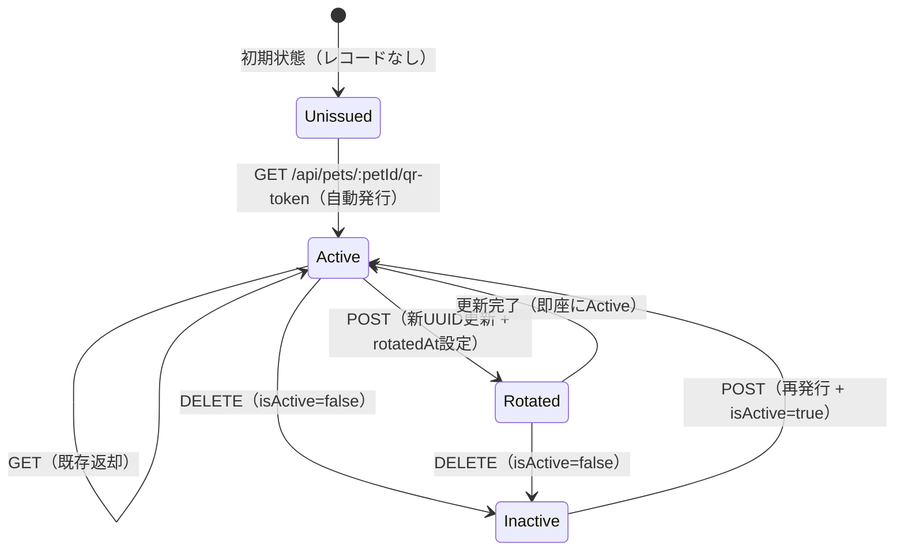
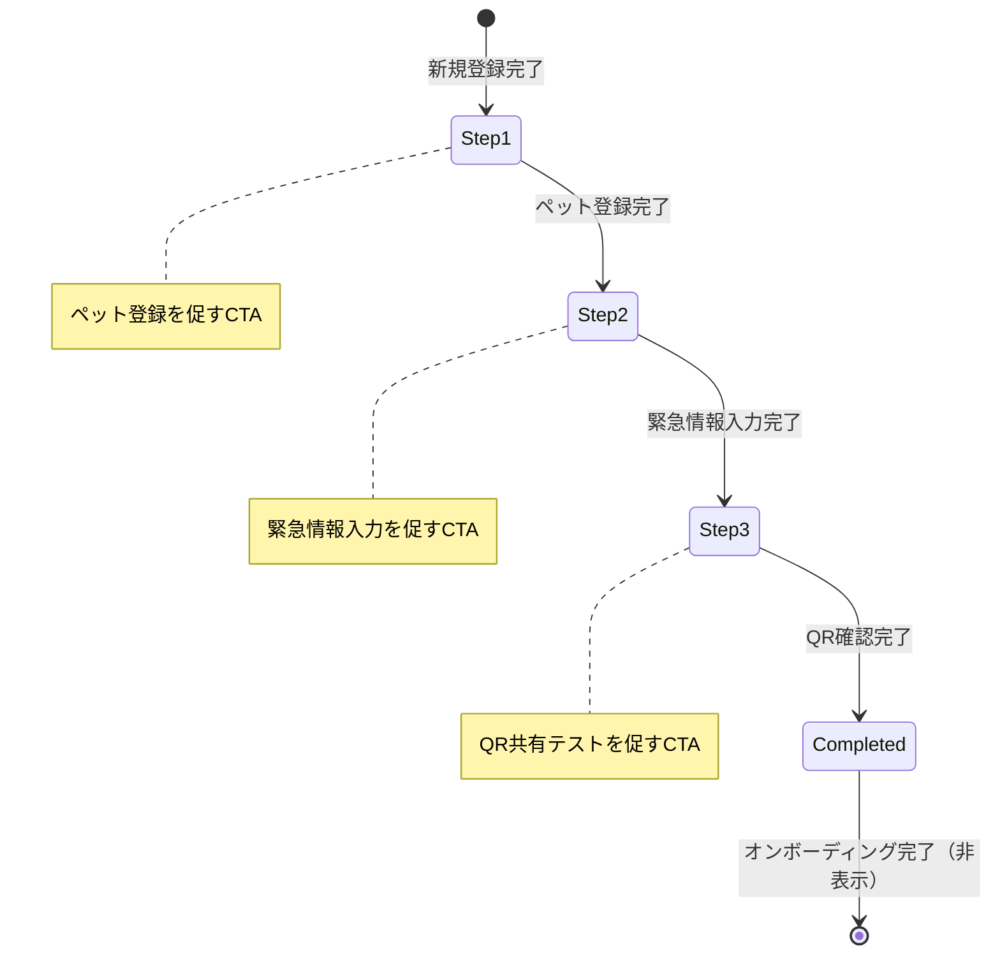

# 04. ドメインモデル・データ設計・状態遷移

作成日: 2026-07-12 | バージョン: 1.0.0

---

## 目次
1. [ドメインモデル](#1-ドメインモデル)
2. [データ設計（現状）](#2-データ設計現状)
3. [データ設計（改善提案）](#3-データ設計改善提案)
4. [状態遷移設計](#4-状態遷移設計)
5. [データフロー](#5-データフロー)

---

## 1. ドメインモデル

### 境界付けられたコンテキスト（Bounded Context）

```
┌─────────────────────┐   ┌─────────────────────┐
│  Identity Context   │   │  Household Context  │
│  ─────────────────  │   │  ─────────────────  │
│  User               │──▶│  Household          │
│  (Supabase Auth)    │   │  HouseholdMember    │
│                     │   │  HouseholdInviteCode│
└─────────────────────┘   └─────────┬───────────┘
                                    │ owns
                          ┌─────────▼───────────┐
                          │    Pet Context      │
                          │  ─────────────────  │
                          │  Pet                │
                          │  PetPhoto           │
                          └─────────┬───────────┘
                                    │ has
        ┌───────────────────────────┼───────────────────────────┐
        │                           │                           │
┌───────▼───────────┐   ┌───────────▼────────────┐   ┌────────▼──────────┐
│ Emergency Context │   │  Medical Context       │   │  Health Context   │
│ ─────────────────│   │  ─────────────────     │   │  ────────────── │
│ PetEmergencyInfo  │   │  PetMedicalRecord      │   │  PetCoreMetric   │
│ PetEmergencyToken │   │  PetMedication         │   │  PetLabResult    │
│                   │   │  PetVaccination        │   │  PetHealthExt    │
└───────────────────┘   │  PetMedicalDocument    │   └──────────────────┘
                        └────────────────────────┘

                          ┌─────────────────────┐
                          │   Billing Context   │
                          │  ─────────────────  │
                          │  Subscription       │
                          │  (Stripe)           │
                          └─────────────────────┘
```

### ドメインオブジェクト定義

#### Household（世帯）
```
責務: 複数ユーザーと複数ペットを束ねるテナント単位
不変条件:
  - 最低1名のOWNERが存在する
  - OWNERが0人になるような操作は拒否される（409）
```

#### Pet（ペット）
```
責務: 動物個体の識別と基本属性の管理
不変条件:
  - householdIdは変更不可（ペットの移動は非サポート）
  - 削除時は関連データを全てCascade削除
重要属性:
  - name, species, breed, sex, birthday
  - weightKg（最新値。推移はPetCoreMetricで管理）
  - microchipNumber（任意だが推奨）
```

#### PetEmergencyInfo（緊急情報）
```
責務: 緊急時に医療従事者が必要とする最小限の医療情報
設計上の重要ポイント:
  - ペット1頭に1レコード（1:1関係）
  - フリーテキストフィールドは緊急時の可読性に課題あり
  - 改善必要: 構造化データ（タグ・カテゴリ）への移行
現状フィールド:
  - disease（持病・フリーテキスト）
  - allergy（アレルギー・フリーテキスト）
  - currentMedications（現在の薬・フリーテキスト）
  - vetName, vetPhone（かかりつけ病院）
  - emergencyContactName, emergencyContactPhone（緊急連絡先）
不足フィールド（要追加）:
  - bloodType（血液型）
  - emergencyVetName/Phone（夜間救急病院）
  - emergencyContactName2/Phone2（第二連絡先）
  - insurerName, policyNumber（保険情報）
  - specialNotes（特記事項・自由記述）
```

#### PetEmergencyToken（緊急トークン）
```
責務: QRコードによる認証なし公開アクセスの制御
不変条件:
  - トークンはUUID v4（推測困難）
  - isActive=falseのトークンは公開APIが404を返す
  - ペット削除時はCascade削除
状態: Unissued → Active → Rotated → Inactive
```

---

## 2. データ設計（現状）

### ERダイアグラム（現在の全テーブル）

```mermaid
erDiagram
  Household ||--o{ HouseholdMember : "has members"
  Household ||--o{ HouseholdInviteCode : "issues"
  Household ||--o{ Pet : "owns"

  Pet ||--o{ PetPhoto : "has"
  Pet ||--|| PetEmergencyInfo : "has emergency info"
  Pet ||--|| PetEmergencyToken : "has token"
  Pet ||--o{ PetMedicalRecord : "has"
  Pet ||--o{ PetMedicalDocument : "has"
  Pet ||--o{ PetMedication : "has"
  Pet ||--o{ PetVaccination : "has"
  Pet ||--o{ PetCoreMetricEntry : "tracks"
  Pet ||--o{ PetLabResultEntry : "records"
  Pet ||--o{ PetHealthExtensionEntry : "records"
  Pet ||--o{ PetMedicationReminder : "has"
  Pet ||--|| PetDisplaySettings : "has"

  Household {
    uuid id PK
    text name
    timestamptz createdAt
    timestamptz updatedAt
  }

  HouseholdMember {
    uuid id PK
    uuid householdId FK
    uuid userId "Supabase Auth ID"
    enum role "OWNER | FAMILY"
    timestamptz createdAt
  }

  HouseholdInviteCode {
    uuid id PK
    uuid householdId FK
    text code UK
    timestamptz expiresAt
    timestamptz usedAt
    uuid usedBy "auth.users.id"
    uuid createdBy "auth.users.id"
    timestamptz createdAt
  }

  Pet {
    uuid id PK
    uuid householdId FK
    text name
    text species
    text breed
    enum sex "MALE | FEMALE | UNKNOWN"
    timestamptz birthday
    int ageYears
    decimal weightKg
    text mainPhotoUrl
    text notesPersonality
    text notesFeatures
    text microchipNumber
    bool isNeutered
    timestamptz neuteredAt
    text ownerName
    text ownerEmail
    text ownerAddress
    timestamptz createdAt
    timestamptz updatedAt
  }

  PetEmergencyInfo {
    uuid id PK
    uuid petId FK UK
    text disease
    text allergy
    text currentMedications
    text vetName
    text vetPhone
    text emergencyContactName
    text emergencyContactPhone
    text bloodType
    text emergencyVetName
    text emergencyVetPhone
    text emergencyContactName2
    text emergencyContactPhone2
    timestamptz updatedAt
  }

  PetEmergencyToken {
    uuid id PK
    uuid petId FK UK
    uuid token UK
    bool isActive
    timestamptz rotatedAt
    timestamptz createdAt
  }

  PetMedicalRecord {
    uuid id PK
    uuid petId FK
    timestamptz date
    enum recordType
    text title
    text description
    text photoUrl
    timestamptz createdAt
    timestamptz updatedAt
  }

  PetMedicalDocument {
    uuid id PK
    uuid petId FK
    text storageKey
    text mimeType
    text ocrRawText
    text ocrStructured
    enum ocrStatus "PENDING | DONE | FAILED"
    timestamptz createdAt
  }

  PetMedication {
    uuid id PK
    uuid petId FK
    text name
    text dosage
    text frequency
    timestamptz startDate
    timestamptz endDate
    timestamptz createdAt
    timestamptz updatedAt
  }

  PetMedicationReminder {
    uuid id PK
    uuid medicationId FK
    uuid petId FK
    text channelType "EMAIL | PUSH"
    text destination
    bool isEnabled
    time reminderTime
    timestamptz lastSentAt
    timestamptz createdAt
  }

  PetVaccination {
    uuid id PK
    uuid petId FK
    enum type "COMBO | RABIES | OTHER"
    text customName
    timestamptz date
    text dateNote
    timestamptz nextDue
    timestamptz createdAt
    timestamptz updatedAt
  }

  PetCoreMetricEntry {
    uuid id PK
    uuid petId FK
    enum type "WEIGHT | TEMPERATURE | HEART_RATE | etc"
    decimal value
    timestamptz recordedAt
    text note
    timestamptz createdAt
  }

  PetLabResultEntry {
    uuid id PK
    uuid petId FK
    enum category "BLOOD | URINE | ENDOCRINE"
    enum marker
    decimal value
    text unit
    timestamptz recordedAt
    text note
    timestamptz createdAt
    timestamptz updatedAt
  }

  PetHealthExtensionEntry {
    uuid id PK
    uuid petId FK
    text name
    decimal value
    text unit
    timestamptz recordedAt
    text note
    timestamptz createdAt
  }

  PetDisplaySettings {
    uuid id PK
    uuid petId FK UK
    bool showMedication
    bool showVaccination
    bool showHealthRecord
    bool showMedicalRecord
    bool emergencyShowMedication
    bool emergencyShowVaccination
    bool emergencyShowMedicalRecord
    timestamptz updatedAt
  }
```

### テーブル設計の問題点

| テーブル | 問題 | 影響 | 改善提案 |
|---|---|---|---|
| `PetEmergencyInfo` | フリーテキスト。持病・アレルギーが構造化されていない | 緊急時の情報提示品質が低い | タグ・リスト形式に変更 |
| `PetEmergencyInfo` | 夜間救急病院・第二連絡先・保険情報が未設計 | 重要な緊急情報が欠落 | フィールド追加 |
| `PetMedication` | 投薬記録（実施済みチェック）が設計されていない | 服薬コンプライアンスが追跡不可 | `PetMedicationLog` テーブルを追加 |
| `PetVaccination` | ワクチン証明書の画像が保存できない | デジタル化の利便性が低下 | `documentUrl` フィールド追加 |
| `AuditLog` | 監査ログがDBに永続化されていない（一部のみ） | セキュリティ・コンプライアンスリスク | `AuditLog` テーブルの整備 |

---

## 3. データ設計（改善提案）

### 追加推奨テーブル

#### PetEmergencyInfoTag（緊急情報タグ）
```sql
CREATE TABLE "PetEmergencyInfoTag" (
  id          UUID PRIMARY KEY DEFAULT gen_random_uuid(),
  petId       UUID NOT NULL REFERENCES "Pet"(id) ON DELETE CASCADE,
  category    TEXT NOT NULL, -- 'DISEASE' | 'ALLERGY_DRUG' | 'ALLERGY_FOOD' | 'ALLERGY_OTHER'
  value       TEXT NOT NULL, -- タグ値 e.g. '糖尿病', 'ペニシリン系'
  severity    TEXT,          -- 'HIGH' | 'MEDIUM' | 'LOW'
  notes       TEXT,
  createdAt   TIMESTAMPTZ DEFAULT NOW()
);
```
**目的**: 持病・アレルギーを構造化し、緊急画面での優先表示を可能にする

#### PetMedicationLog（投薬実施ログ）
```sql
CREATE TABLE "PetMedicationLog" (
  id            UUID PRIMARY KEY DEFAULT gen_random_uuid(),
  medicationId  UUID NOT NULL REFERENCES "PetMedication"(id) ON DELETE CASCADE,
  petId         UUID NOT NULL REFERENCES "Pet"(id) ON DELETE CASCADE,
  scheduledAt   TIMESTAMPTZ NOT NULL,
  administeredAt TIMESTAMPTZ,  -- NULL = 未実施
  skippedAt     TIMESTAMPTZ,  -- NULL = スキップなし
  skipReason    TEXT,
  administeredBy UUID,  -- auth.users.id
  notes         TEXT,
  createdAt     TIMESTAMPTZ DEFAULT NOW()
);
```
**目的**: 投薬の実施・スキップを追跡し、服薬コンプライアンスを管理

#### AuditLog（監査ログ）
```sql
CREATE TABLE "AuditLog" (
  id           UUID PRIMARY KEY DEFAULT gen_random_uuid(),
  householdId  UUID REFERENCES "Household"(id) ON DELETE SET NULL,
  petId        UUID REFERENCES "Pet"(id) ON DELETE SET NULL,
  userId       UUID NOT NULL,  -- auth.users.id
  action       TEXT NOT NULL,  -- 'CREATE' | 'UPDATE' | 'DELETE' | 'VIEW_EMERGENCY'
  resourceType TEXT NOT NULL,  -- 'Pet' | 'PetEmergencyInfo' | 'PetMedication' etc
  resourceId   UUID,
  oldData      JSONB,
  newData      JSONB,
  ipAddress    TEXT,
  userAgent    TEXT,
  createdAt    TIMESTAMPTZ DEFAULT NOW()
);
-- 保持期間: 3年（法的要件）
-- インデックス: userId, householdId, createdAt
```
**目的**: セキュリティ・コンプライアンス・変更追跡

---

## 4. 状態遷移設計

### サブスクリプション状態遷移

```mermaid
stateDiagram-v2
  [*] --> Trial: 新規登録
  Trial --> Active: 課金成功（Stripe Webhook）
  Trial --> Expired: 30日経過・課金なし
  Active --> Canceled: 解約（次の更新日まで利用可）
  Active --> PastDue: 支払い失敗（リトライ中）
  Active --> Inactive: 支払い失敗（リトライ上限）
  Canceled --> Active: 再度課金
  PastDue --> Active: 支払い成功
  PastDue --> Inactive: リトライ失敗
  Expired --> Active: 課金開始
  Inactive --> Active: 再度課金

  note right of Trial: 機能: 全機能利用可
  note right of Active: 機能: 全機能利用可
  note right of Expired: 機能: 閲覧のみ（30日）
  note right of Canceled: 機能: 期間中は全機能
  note right of PastDue: 機能: 全機能（猶予期間中）
  note right of Inactive: 機能: 閲覧のみ
```

**accessPolicy の設計**:
```typescript
type AccessPolicy = {
  canCreate: boolean      // ペット・記録の作成
  canEdit: boolean        // 記録の編集
  canDelete: boolean      // ペット・記録の削除
  canShare: boolean       // QR共有・PDF出力
  canNotify: boolean      // リマインダー送信
  historyDays: number     // 履歴閲覧可能日数（-1 = 無制限）
}

const policies: Record<SubscriptionStatus, AccessPolicy> = {
  Trial:    { canCreate: true, canEdit: true, canDelete: true, canShare: true, canNotify: true, historyDays: -1 },
  Active:   { canCreate: true, canEdit: true, canDelete: true, canShare: true, canNotify: true, historyDays: -1 },
  Canceled: { canCreate: true, canEdit: true, canDelete: true, canShare: true, canNotify: true, historyDays: -1 },
  PastDue:  { canCreate: true, canEdit: true, canDelete: true, canShare: true, canNotify: true, historyDays: -1 },
  Expired:  { canCreate: false, canEdit: false, canDelete: false, canShare: false, canNotify: false, historyDays: 30 },
  Inactive: { canCreate: false, canEdit: false, canDelete: false, canShare: false, canNotify: false, historyDays: 30 },
}
```

### QRトークン状態遷移



### オンボーディング状態遷移



---

## 5. データフロー

### 緊急情報更新フロー

```
飼い主が緊急情報を更新
  ↓
PUT /api/pets/:petId/emergency-info
  ↓
Zodバリデーション（電話番号正規化含む）
  ↓
Prisma: PetEmergencyInfo.upsert()
  ↓
AuditLog記録（USER, UPDATE, PetEmergencyInfo）
  ↓
緊急公開画面に即時反映（キャッシュなし）
```

### QRスキャン → 緊急情報取得フロー

```
医療従事者がQRスキャン
  ↓
/e/:token（Next.js Page）
  ↓
GET /api/public/emergency/:token
  ↓
UUID形式バリデーション
  ↓
Supabase RPC: get_public_emergency_by_token(uuid)
  ↓
PostgreSQL: security definer 関数
  SELECT pet.name, pet.species, ...
         emergency.disease, emergency.allergy, ...
  WHERE token.token = input_token
    AND token.isActive = true
  ↓
EmergencyViewPayload を返却
  ↓
緊急情報カードに表示
```

### Stripe Webhook フロー

```
課金イベント発生（Stripe）
  ↓
POST /api/billing/webhook
  ↓
署名検証（stripe.webhooks.constructEvent）
  ↓
イベント種別で分岐:
  checkout.session.completed → subscriptionStatus = 'active'
  invoice.payment_failed → subscriptionStatus = 'past_due'
  customer.subscription.deleted → subscriptionStatus = 'canceled'
  ↓
Prisma: Household.subscriptionStatus 更新
  ↓
AuditLog記録
  ↓
200 OK（冪等）
```

---

## 設計上の重要な決定事項

### 決定1: フリーテキスト vs 構造化データ

**現状**: 持病・アレルギーはフリーテキスト
**推奨**: 段階的に構造化データへ移行

理由:
- 緊急時の情報表示品質が向上する
- アレルギーの「薬剤 vs 食品」分類が可能になる
- 将来の動物病院システム連携でデータ変換が容易になる

移行方針:
1. `PetEmergencyInfoTag` テーブルを追加（既存フィールドは保持）
2. UIでタグ入力を追加（フリーテキストと並存）
3. 既存フリーテキストデータを自動タグ化（AI補助）
4. フリーテキストフィールドを非推奨化（最終的に削除）

### 決定2: テナント分離の方式

**採用**: Row Level Security（RLS）+ アプリ層の認可チェックの二重防御
**理由**: RLSだけでは万全ではなく、アプリ層のバグで RLS を迂回するリスクを二重で防ぐ
**トレードオフ**: 実装の複雑さが増すが、セキュリティと保守性を優先

### 決定3: 監査ログの設計

**現状**: 一部のみDBに保存（OWNER復旧時のみ）
**問題**: セキュリティ監査・コンプライアンスに不十分
**推奨**: 全CRUD操作を `AuditLog` テーブルに記録
**実装難易度**: Medium
**優先度**: Phase 2 で実装（商用化前に必須）
