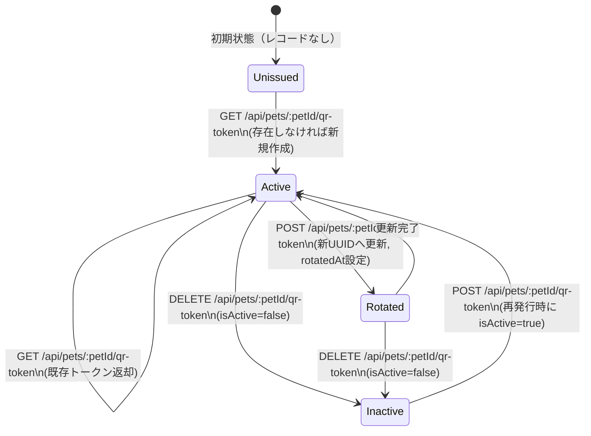

# 公開トークン状態遷移図

対象: `PetEmergencyToken`（`/api/pets/:petId/qr-token`, `/api/public/emergency/:token`）

## 遷移ルール
- `GET /api/pets/:petId/qr-token`
  - レコードなし: 新規発行して `isActive=true`
  - レコードあり: 既存トークンを返却（再発行はしない）
- `POST /api/pets/:petId/qr-token`
  - `upsert` で常に新トークンへ更新（再発行）
  - 更新時は `rotatedAt` を現在時刻に設定
  - 常に `isActive=true` に戻す
- `DELETE /api/pets/:petId/qr-token`
  - 有効トークンを `isActive=false` に更新
  - すでに `isActive=false` の場合はそのまま返却（冪等）
  - トークン未発行時は `404`
- `GET /api/public/emergency/:token`
  - UUID形式不正は `400`
  - RPC結果なし（未発行・失効・不一致）は `404`
  - 有効トークンのみ `200` で緊急公開情報を返却

## 補足
- 公開参照は RPC `get_public_emergency_by_token(uuid)` を使用し、`isActive=true` のみ返却。
