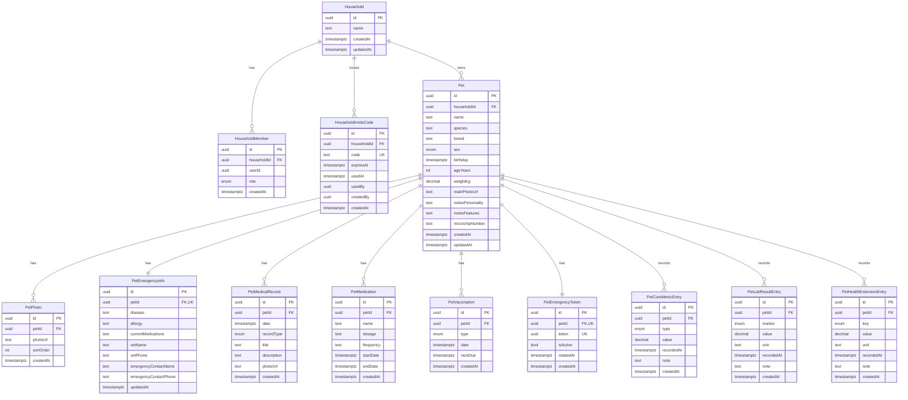

# Supabase Schema Design

本ドキュメントは、`prisma/schema.prisma` を基準にした現在のER構成です。

## ER図（Mermaid）

## 補足
- すべての外部キーは `ON DELETE CASCADE`。
- 1:1は `PetEmergencyInfo.petId` と `PetEmergencyToken.petId` の `UNIQUE` で担保。
- `HouseholdMember.userId`, `HouseholdInviteCode.usedBy`, `HouseholdInviteCode.createdBy` は Supabase Auth (`auth.users.id`) を参照する想定。
